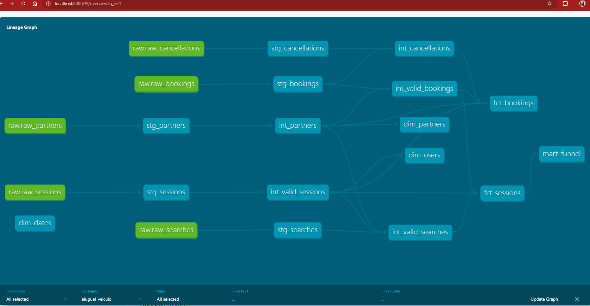

# End-to-End Analytics Engineering Case | Rentcars

Este projeto é uma implementação completa de um **Data Warehouse moderno orientado a produto**, construído com foco em:

- Escalabilidade
- Governança de dados
- Confiabilidade analítica
- Alinhamento com stakeholders

A solução cobre todo o ciclo de dados: ingestão → modelagem → qualidade → métricas → storytelling.

---

## Contexto do Problema

A plataforma de aluguel de veículos gera dados distribuídos entre:

- Sessões de navegação
- Buscas
- Reservas
- Cancelamentos
- Parceiros

O desafio é transformar esse ecossistema em um modelo confiável para responder perguntas críticas de negócio, como:

- Onde estamos perdendo conversão?
- Quais parceiros geram mais valor?
- Existe comportamento suspeito (bots)?
- Qual o impacto real dos cancelamentos?

---

## Arquitetura de Dados

RAW → STAGING → INTERMEDIATE → MARTS

RAW (sources)
  ↓
STG (limpeza + padronização)
  ↓
INT (regras de negócio + validações)
  ↓
CORE
  ├── fct_sessions
  ├── fct_bookings
  ├── dim_users
  ├── dim_partners
  ├── dim_dates
  ↓
MARTS
  └── mart_funnel

---

## Modelagem (Decisões Técnicas)

### ⭐ Star Schema
Separação entre fatos e dimensões para garantir performance e consistência.

### Incremental Models
Uso de estratégia incremental para escalar processamento de grandes volumes.

### Data Quality
Testes com dbt e dbt-expectations garantindo confiabilidade.

### Regras de Negócio
Camada intermediate centraliza validações, remoção de bots e anomalias.

---

## Camada Analítica

### mart_funnel

Principais métricas:

- Conversão
- Receita
- Ticket médio
- Engajamento

---

## Dashboard & Insights

- Evolução de receita
- Funil de conversão
- Cancelamentos

Foco em insights acionáveis.

---

## Analytics

- Conversão por país/device
- Top parceiros
- LTV
- Detecção de bots
- Outliers

---

## Governança

- SLA de dados
- PII
- Catálogo
- Data contract

---

## Como rodar

```bash
pip install dbt-core dbt-postgres
dbt deps
dbt run
dbt test
```

---

## Roadmap

- SCD2
- CI/CD
- Observabilidade
- Testes avançados

---

## Diferenciais

✔ Arquitetura escalável  
✔ Data quality embutido  
✔ Foco em negócio  
✔ Pensamento de produto  

---

## TL;DR

Projeto que demonstra capacidade real de  Analytics Engineer.


---

## 🔗 Data Lineage (dbt)



Este grafo representa o fluxo completo de dados no projeto:

- Camada RAW → STAGING → INTERMEDIATE → MARTS
- Separação clara entre regras de negócio e consumo analítico
- Dependências explícitas entre fatos e dimensões

Destaque para:
- Centralização de regras na camada `int_`
- Construção incremental das facts (`fct_sessions`, `fct_bookings`)
- Camada final otimizada para consumo (`mart_funnel`)
